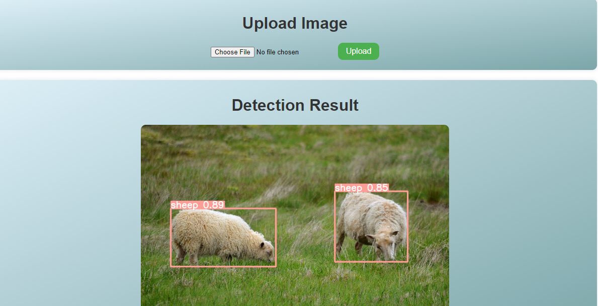

# YOLOv5 Object Detection

This project demonstrates the end-to-end workflow of training and using the YOLOv5 model for object detection tasks. It provides instructions on running the notebook both on Google Colab and locally as well as running the flask server and making predictions from the UI

# Running Jupyter Notebook
## Running on Google Colab

1. Clone the repository.
2. Open the `yolov5.ipynb` notebook in Google Colab.
3. Upload the `data.zip` and `dataset.yaml` files.
4. Move the `dataset.yaml` file to `yolov5/data`.
5. Follow the instructions provided in the notebook to run the training and inference processes.

## Running Locally

1. Clone the repository.
2. Run the notebook according to the instructions provided.
3. Modify the paths in the `dataset.yaml` file according to your local setup.
4. Move the `dataset.yaml` file to `yolov5/data`.

By following these steps, you will be able to train and use the YOLOv5 model for object detection tasks. Make sure to properly set up the dataset and modify the configuration files as required for your specific project.

Please note that the `dataset.yaml` file contains the necessary configuration for your dataset, including paths, class labels, and number of classes. Make sure to customize it to match your dataset structure and requirements.

Feel free to refer to the notebook for more detailed instructions and explanations throughout the training and inference processes.

# Running server

1. Clone the repository.
2. Navigate to the current folder and run app.py